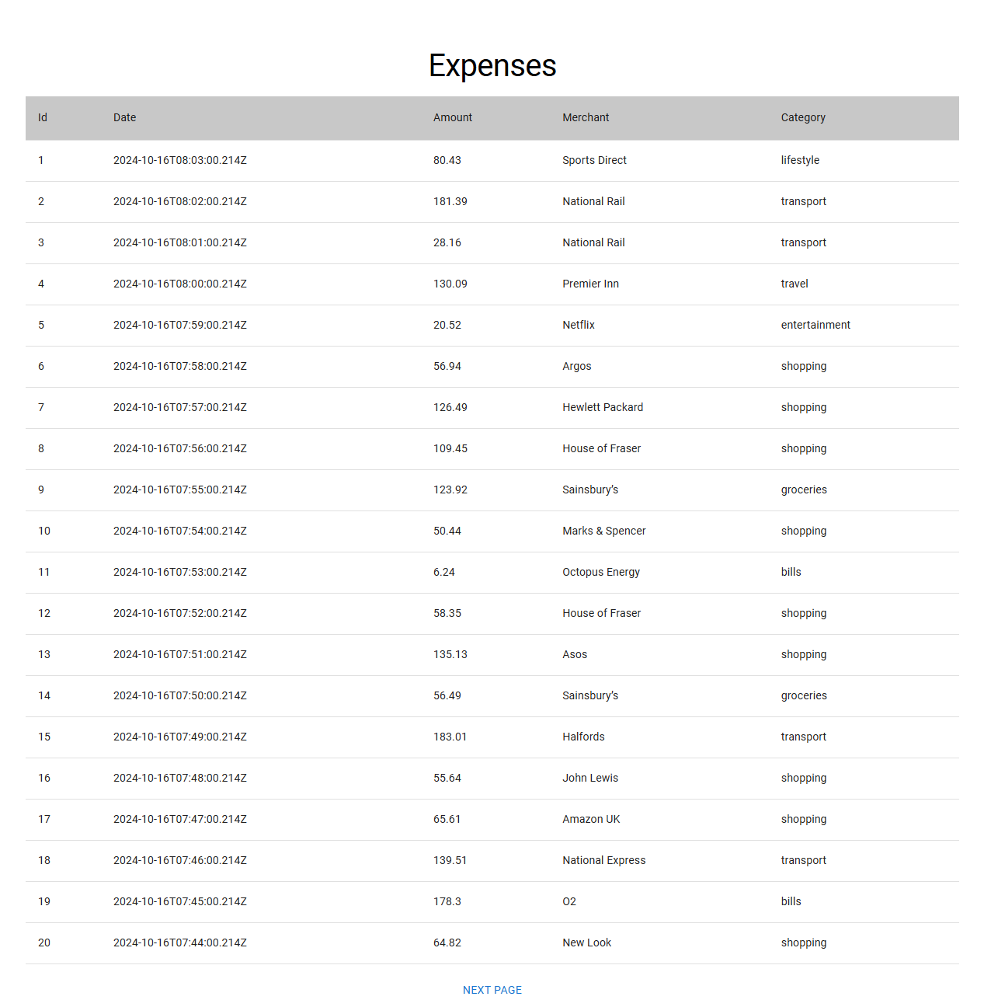

## Kaixuan Khoo Tipalti Submission

This is my submission for the 'Take Home' assessment from Tipalti for the React Expenses Table.

This submission uses React Query for api fetching, MUI Material for styling and components, and zod for typescript (see `hooks/expensesTable.ts`)

I also implemented a 'Previous' and 'Next' page button (even though it wasn't necessary)

The table looks like this:

